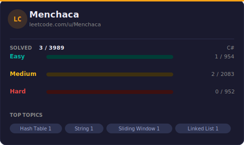

<div align="center">

# LeetCode Solutions

**Solutions to LeetCode problems — auto-synced daily via GitHub Actions.**

**Supported languages:** C++ · C · Python · Java · JavaScript · TypeScript · Go · Rust · C# · Swift · Kotlin · Ruby · and more

<br/>



<br/>

[](https://github.com/FMenchaca/LeetCode-Solutions/commits/main)

</div>

---

## Repository Structure

```
solutions/
├── Easy/       # Problems that test core fundamentals
├── Medium/     # Require solid algorithmic thinking
└── Hard/       # Advanced data structures & algorithms
```

Each solution file includes a structured header with:

- Problem title, number, and direct LeetCode link
- Difficulty level and topic tags
- Full problem description
- Runtime and memory stats with percentile rankings
- Language used and submission date

---

## How It Works

A GitHub Actions workflow runs every night at midnight CST. It polls the LeetCode
GraphQL API for new accepted submissions in any supported language, fetches the full
problem metadata and performance stats, writes each solution as a properly formatted
file (`.cpp`, `.py`, `.java`, `.js`, etc.) organized by difficulty, regenerates the
stats card above, and commits everything automatically.

No third-party Actions are used for the sync — it's pure Python with `requests`.
The workflow only has `contents: write` permission. Your LeetCode session cookies
are stored as encrypted GitHub Secrets and are never written to disk or committed.

---

## Security

- `LEETCODE_SESSION` and `LEETCODE_CSRF_TOKEN` are **encrypted GitHub Secrets**
- The workflow uses a minimal `contents: write` permission scope
- No credentials are ever committed to the repository
- Session cookies should be refreshed every 30–90 days when they expire

---

<div align="center">

*Stats card updates automatically each time a new solution is synced.*

</div>
